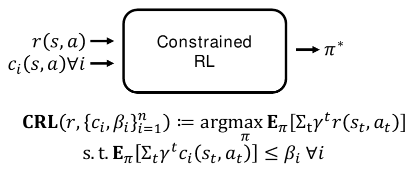
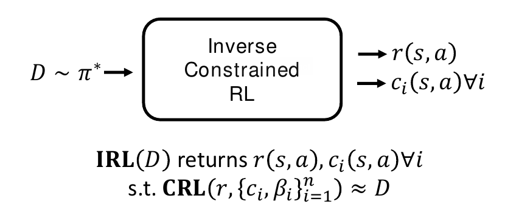
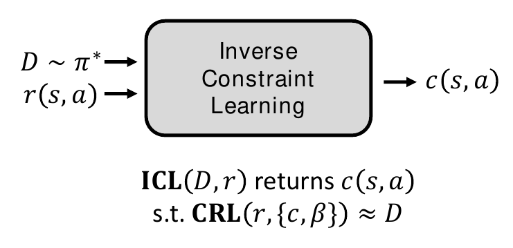
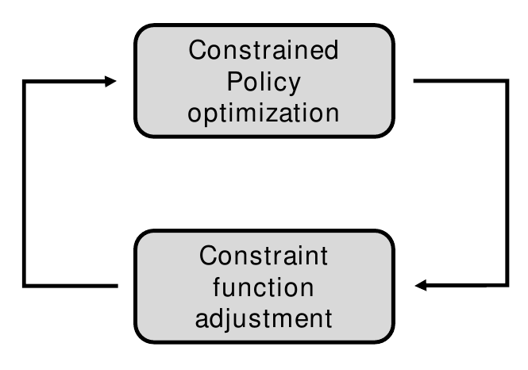

## Inverse Constraint Learning

Paper: [Learning Soft Constraints From Constrained Expert Demonstrations, Gaurav et al. (2023)](https://openreview.net/forum?id=8sSnD78NqTN)

This repository contains the code for ICL paper. After you run any command, the results will be logged to tensorboard.

## How does it work?

Constrained RL takes in reward and constraint(s) and produces an optimal constrained policy.

The inverse problem, i.e. Inverse Constrained RL takes in a dataset of trajectories sampled using an optimal expert and produces a set of reward and constraint(s) such that they produce the expert policy when CRL is performed with them.

Due to unidentifiability, Inverse Constrained RL is a difficult problem. Hence, we solve a simplified problem - i.e. we assume the reward is known and that we only need to learn a single constraint.

The idea is inspired from the IRL template, which alternates between policy optimization and reward adjustment. In our case, we alternate between constrained policy optimization and constraint function adjustment.

For further details regarding the optimization and algorithm, please see the [paper](https://openreview.net/forum?id=8sSnD78NqTN).

We conduct several experiments across synthetic environments, robotics environments and real world highway environments. The steps to run these experiments are detailed further in this README.

## Setup
* Install OpenMPI and Mujoco 2.1.0
* Update `tools/__init__.py` constants to have the correct directories for ExiD dataset.
* Install `tools` package by running `pip install .` in the root directory. 

## High level workflow

* If you face any OpenGL error, install `Xvfb` and prefix the command with `xvfb-run -a`.
* For the rest of the commands, replace:
    * `SEED=1/2/3/4/5/anything`
    * `BETA=anything` (if `BETA=-1` then the default, defined in the config file, is used)
    * `ENV` is defined depending on the environments:
        * Gridworld (A): `ENV=gridworldA`
        * Gridworld (B): `ENV=gridworldB`
        * CartPole (MR): `ENV=cartpoleMR`
        * CartPole (Mid): `ENV=cartpoleM`
        * HighD: `ENV=highdgap`
        * Ant-Constrained: `ENV=ant`
        * HalfCheetah-Constrained: `ENV=hc`
        * ExiD: `ENV=exid`
* Expert data (either generate OR use saved data):
    * Use saved data: `cp expert-data/data-ENV.pt data.pt`
    * Generate for HighD environment: `python3 -B expert-highD.py`
    * Generate for ExiD environment: `python3 -B expert-exiD.py` (this uses
    data in `tools/assets/exiD`, already provided, which was generated using `prepare_exid_data.py`)
    * Generate for other environments: `python3 -B expert.py -c configs/ENV.json`
* Run methods
    * ICL: `python3 -B icl.py -c configs/ENV.json -seed SEED -beta BETA`
    * GAIL-Constraint: `python3 -B gail_constraint.py -c configs/gail-ENV.yaml -seed SEED`
    * ICRL: `python3 -B icrl.py -c configs/icrl-ENV.yaml -seed SEED`

## Credits

Please check the individual repositories for licenses.

* ICRL code: 
  * https://github.com/shehryar-malik/icrl
  * https://github.com/Guiliang/constraint-learning
* OpenAI safety agents (`tools.safe_rl`):
  * https://github.com/openai/safety-starter-agents
* HighD dataset
  * https://www.highd-dataset.com
  * We include one sample set of assets (#17) from the dataset in the code, since it is necessary to run the HighD environment.
* ExiD dataset
  * https://www.exid-dataset.com/
  * Free for non-commercial use, but to get the dataset, you must request it.
  * You must place this dataset in (any) directory and update `tools/__init__.py` as
  mentioned previously.
* Wise-Move environment
  * https://git.uwaterloo.ca/wise-lab/wise-move
  * https://github.com/ashishgaurav13/wm2
* Gridworld environment
  * https://github.com/yrlu/irl-imitation
* Gym environment and wrappers
  * https://github.com/ikostrikov/pytorch-ddpg-naf
  * https://github.com/vwxyzjn/cleanrl
  * https://github.com/openai/gym
* Normalizing flows
  * https://github.com/ikostrikov/pytorch-flows
  * https://github.com/tonyduan/normalizing-flows
  * https://github.com/VincentStimper/normalizing-flows
